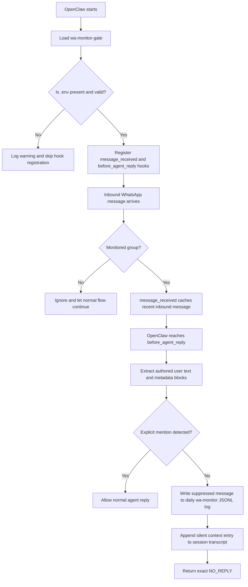

# Openclaw WhatsApp Monitor Gate

`wa-monitor-gate` is an OpenClaw hook extension that suppresses visible replies in selected WhatsApp groups unless an explicit mention rule passes.

## What It Does

- Watches inbound WhatsApp traffic for monitored group chats.
- Allows replies only when the authored user text contains one of the configured target numbers, bot mention IDs, or matches the configured bot name regex.
- Returns the exact text `NO_REPLY` for monitored group messages without an explicit mention.
- Logs suppressed messages into `workspace/memory/wa-monitor/YYYY-MM-DD.jsonl`.
- Appends structured suppressed-message context into the corresponding session transcript so later explicit mentions can recall prior no-reply messages.

## Flow Diagram

The diagram below shows both the startup validation path and the runtime gating path:



In practice, the explicit mention check only looks at the authored user text plus WhatsApp mention metadata, so sender labels and metadata wrappers do not accidentally trigger a visible reply.

## Required Files

- `index.mjs`: main plugin implementation.
- `.env`: required runtime settings for group IDs, mention targets, and workspace path.
- `.env.example`: safe starter template for new installs.
- `openclaw.plugin.json`: OpenClaw plugin metadata.

## Install in OpenClaw

This extension is meant to live inside your OpenClaw workspace extensions directory.

### Option A: Ask your OpenClaw agent

If your OpenClaw agent can edit files and run commands in your workspace, you can install this extension directly from chat.

In your OpenClaw chat or TUI, say:

> Install wa-monitor-gate from https://github.com/LiemFrans/whatsapp-monitor-gate into `workspace/.openclaw/extensions/wa-monitor-gate`. Copy `.env.example` to `.env`, ask me for the real values before finishing `.env`, add `wa-monitor-gate` to `plugins.allow`, enable it in `plugins.entries`, and restart OpenClaw.

Expected result:

- The extension files are placed under `workspace/.openclaw/extensions/wa-monitor-gate`.
- `.env.example` is copied to `.env`.
- The agent pauses for any real values that cannot be guessed safely.
- `openclaw.json` is updated so the plugin is allowed and enabled.
- OpenClaw is restarted so the plugin can load.

If the agent cannot clone the GitHub repository directly, ask it to create the same files manually in `workspace/.openclaw/extensions/wa-monitor-gate` and continue with the same setup steps.

### Option B: Manual install

1. Place the extension folder at `workspace/.openclaw/extensions/wa-monitor-gate`.
2. Copy `.env.example` to `.env`.
3. Replace all placeholder values in `.env` with your real WhatsApp group IDs, target numbers, mention IDs, bot name regex, and OpenClaw workspace path.
4. Add `wa-monitor-gate` to `plugins.allow` in `openclaw.json`.
5. Enable the plugin in `plugins.entries` in `openclaw.json`.
6. Restart OpenClaw.

Minimal `openclaw.json` example:

```json
{
	"plugins": {
		"allow": [
			"wa-monitor-gate"
		],
		"entries": {
			"wa-monitor-gate": {
				"enabled": true
			}
		}
	}
}
```

The plugin metadata lives in `openclaw.plugin.json` and activates on the OpenClaw `hook` capability.

## WhatsApp Routing Notes

This extension only gates replies after messages have already been routed into the agent pipeline.

- Put your monitored group IDs in `.env` under `FALLBACK_MONITORED_GROUPS`.
- Keep those groups routable in `channels.whatsapp.groups`.
- If you want every message in a monitored group to reach the agent and let this extension decide whether to suppress replies, set those group policies to `requireMention: false`.
- Leave the wildcard `*` policy stricter if you do not want all other groups routed the same way.

## Required Environment Variables

The extension no longer falls back to hardcoded defaults. If any required setting is missing or invalid, the extension logs a warning and does not register its hooks.

Required keys in `.env`:

- `FALLBACK_MONITORED_GROUPS`
- `TARGET_NUMBER`
- `TARGET_DIGITS`
- `BOT_MENTION_ID`
- `BOT_NAME_RE`
- `FALLBACK_WORKSPACE_DIR`

List values support either comma-separated strings or JSON arrays.

Start by copying `.env.example` to `.env`, then replace the placeholder values with your real settings.

Example:

```env
FALLBACK_MONITORED_GROUPS=your-group-1@g.us,your-group-2@g.us
TARGET_NUMBER=+6200000000000,+6200000000001
TARGET_DIGITS=6200000000000,6200000000001
BOT_MENTION_ID=100000000000000,100000000000001
BOT_NAME_RE=/\b(cici|assistant)\b/i
FALLBACK_WORKSPACE_DIR=/path/to/.openclaw/workspace
```

Validation rules:

- `FALLBACK_MONITORED_GROUPS` entries must end with `@g.us`.
- `TARGET_NUMBER` and `TARGET_DIGITS` entries must contain digits.
- `BOT_MENTION_ID` entries must be non-empty.
- `BOT_NAME_RE` must compile as a valid JavaScript regular expression.
- `FALLBACK_WORKSPACE_DIR` must be a non-empty path string.

## Explicit Mention Rules

A monitored group message is allowed to produce a visible reply when at least one condition matches the authored user text:

- It contains a configured `TARGET_NUMBER` value.
- It contains a configured `TARGET_DIGITS` value.
- It contains `@<BOT_MENTION_ID>` or the raw configured bot mention ID.
- It matches `BOT_NAME_RE`.
- WhatsApp metadata marks the bot as mentioned via `was_mentioned` or `wasMentioned`.

The extension extracts authored text from WhatsApp payloads so sender labels and metadata wrappers do not accidentally trigger mention rules.

## Logs and Session Context

Suppressed messages are persisted in two places:

- Daily raw monitor log: `workspace/memory/wa-monitor/YYYY-MM-DD.jsonl`
- Session transcript append: `agents/<agent>/sessions/<sessionId>.jsonl`

The transcript entry is stored as a silent WhatsApp context block so later explicit mentions can ask about earlier suppressed messages.

## Operations

After changing `index.mjs` or `.env`, restart OpenClaw so the extension reloads:

```bash
sudo systemctl restart openclaw
```

If configuration is invalid, check the OpenClaw logs for a warning similar to:

```text
wa-monitor-gate disabled due to invalid settings in .../.env: ...
```